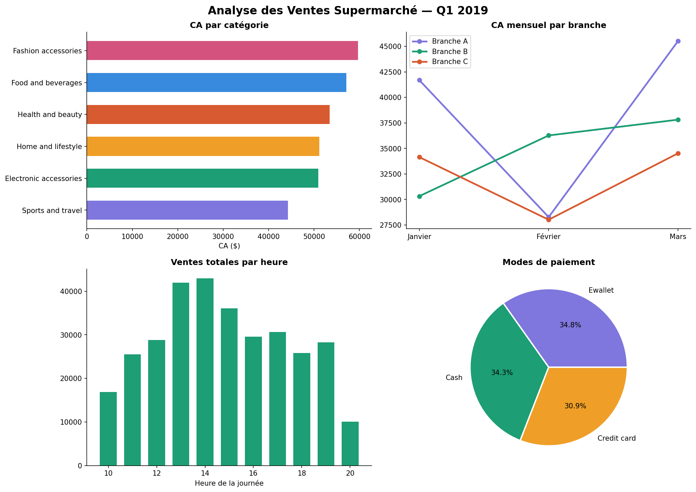

# Analyse Exploratoire des Ventes — Supermarche Q1 2019


---



---

## C'est quoi ce projet

J'ai travaille sur un dataset de ventes d'une chaine de supermarchés implantee dans 3 villes (branches A, B, C) sur le premier trimestre 2019 — 1 000 transactions, 17 variables.

La question de depart c'etait : a partir de simples donnees de caisse, est-ce qu'on peut comprendre ce qui drive les ventes et la satisfaction client ? C'est le type d'analyse qu'on retrouve dans beaucoup d'entreprises retail ou e-commerce, ou les donnees existent mais ne sont pas toujours exploitees.

---

## Les questions auxquelles j'ai cherche a repondre

- Quelles categories de produits generent le plus de chiffre d'affaires ?
- Y a-t-il des heures ou des periodes plus rentables que d'autres ?
- Le type de client (membre vs normal) influence-t-il le panier moyen ?
- Y a-t-il un lien entre la satisfaction client et le montant depense ?

---

## Ce que j'ai fait

**1. Chargement et preparation**
Parsing des colonnes date et heure, creation de variables derivees (heure, mois), verification des valeurs manquantes et doublons.

**2. KPIs business**
Calcul des metriques cles : CA total, benefice brut, panier moyen, note moyenne, performances par branche.

**3. Analyse par dimension**
Decomposition du CA par categorie, par heure, par branche et par mois. Comparaison membres vs clients normaux.

**4. Visualisations**
4 graphiques complementaires (barplot horizontal, courbes temporelles, histogramme horaire, camembert modes de paiement) + matrice de correlation.

**5. Insights et recommandations**
Formulation de recommandations concretes basees sur les donnees — pas juste decrire les graphiques.

---

## Les insights principaux

- **Fashion accessories** est la categorie avec le plus fort CA sur le trimestre
- **L'heure de pointe se situe entre 13h et 14h** — pic tres net sur le graphique horaire
- **La satisfaction client n'est pas correlee au montant depense** (correlation quasi nulle) — c'est contre-intuitif et c'est exactement le genre de decouverte que l'EDA permet
- Les modes de paiement sont repartis de facon quasi-egale (Ewallet 34.8%, Cash 34.3%, Credit card 30.9%) — aucun canal ne domine vraiment
- Panier moyen membres vs clients normaux : difference minime, le programme de fidelite n'a pas d'impact significatif sur le montant depense

---

## Stack technique

| Outil | Usage |
|---|---|
| Python + Pandas | Chargement, nettoyage, agregations |
| Matplotlib | Visualisations personnalisees |
| Seaborn | Matrice de correlation |
| Jupyter Notebook | Analyse interactive |

---

## Structure

```
supermarket-eda/
├── supermarket_sales.csv       <- dataset source (Kaggle)
├── supermarket_eda.ipynb       <- notebook complet
├── analyse_complete.png        <- dashboard 4 graphiques
└── heatmap_correlations.png    <- matrice de correlation
```

---

## Ce que j'ai retenu

Ce qui m'a le plus marquee dans ce projet c'est que les donnees racontent parfois le contraire de ce qu'on attend. On s'attendrait logiquement a ce que les clients tres satisfaits depensent plus — ce n'est pas ce que les donnees montrent. Ce genre de resultat contre-intuitif est exactement la raison pour laquelle on fait une EDA avant de tirer des conclusions.

J'ai aussi realise que la partie la plus longue n'est pas de produire les graphiques, c'est de se poser les bonnes questions en amont. Un graphique sans question derriere ne sert a rien.

---

## A propos

Barbare Lina — Etudiante en Master 1 Sciences et ingenieurie de données
